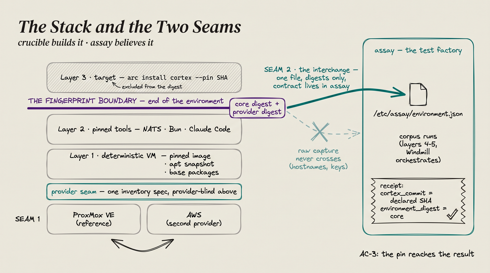

# The stack and the two seams

*crucible builds it · assay believes it.*

## Why two factories

A test result is only worth what you know about the conditions it ran
under. [assay](https://github.com/the-metafactory/assay) produces
**verdicts** — claims paired with executable comparisons that can fail.
crucible produces the **conditions** — environments declared in git, built
to a digest, never mutated in place, destroyed after use, identity
recorded. The seam between the two factories is what lets each stay honest
about its half.

## The stack, bottom to top

The layer model is Vincent Zontini's, from the reference implementation;
the boundaries are now enforced by tooling rather than discipline.

**Seam 1 — the provider seam.** ProxMox VE and AWS swap *below* one
inventory `spec`; everything above is provider-blind (`tofu.py`,
`site.yaml`, every role, the fingerprint script). Agnosticism is a
contract, not an abstraction layer, and it is measured: an environment
definition is proven portable when its provider-invariant **core digest**
matches across providers (§5b of the
[design spec](design-infrastructure-factory.md)).

**Layers 1–2 — the environment.** A deterministic VM (pinned cloud image,
`snapshot.ubuntu.com` apt pin, base packages), then pinned tools that apt
cannot supply (NATS, Bun, Claude Code). This is everything the fingerprint
covers, and it ends at **the fingerprint boundary**: capture → **core
digest** (provider-invariant) + **provider digest** (where honest
differences between providers live, on the record).

**Layer 3 — the target.** `arc install <target> --pin <sha>` puts the
software under test *on* the machine but *not in* its identity — the
fingerprint prunes everything the target installs, including arc's CLI
shims. This exclusion is enforced, not aspirational, and it is what makes
*"same environment, two target versions"* an expressible comparison. That
comparison is the factory's entire purpose.

**Seam 2 — the interchange.** One file on the machine:
`/etc/assay/environment.json`, carrying the two digests and nothing else.
The raw capture never crosses — hostnames and keys stay in the operator's
private overlay. The contract is **defined in assay**
([`environments/README.md`](https://github.com/the-metafactory/assay/blob/main/environments/README.md))
and **implemented by crucible** (§4a), deliberately: an instrument that
depends on one implementation of the thing it measures is not an
instrument, and a second copy of a contract is a contract that drifts.

**The receipt closes the loop.** A corpus run stamps
`captured_on.cortex_commit` (the declared pin) and
`captured_on.environment_digest` (the core digest). When both hold on a
factory VM, that is **AC-3 — the pin has reached the result** — and the
corpus's *"unpinned baseline: 12 of 12"* count starts falling.

## The three repos, and the division of honesty

| Repo | Role | Claim it carries |
|---|---|---|
| [smithy](https://github.com/vpzed-dev/smithy) | **reference implementation** — the working tofu, Ansible, fingerprint, guards, evidence; Vincent's, on real hardware | *the design runs* |
| crucible | **spec home** — DDs, phases, criteria, the seams defined; grows `modules/vm-aws` at Phase 2 and consumes smithy at a **pinned SHA** | *the design is portable* |
| assay | **the instrument** — owns the interchange contract and the corpus; consumes identity, produces receipts | *what ran was what you declared* |

crucible is not a fork of smithy and never syncs with it: improvements
flow **to** smithy as PRs (never into a private copy — DD-11), and
crucible consumes it at one recorded ref, bumped deliberately. The
provider seam exists precisely so smithy-on-ProxMox and crucible-on-AWS
are the *same factory*, measured by the same digest.

The digests are the only thing that travels between the three.
